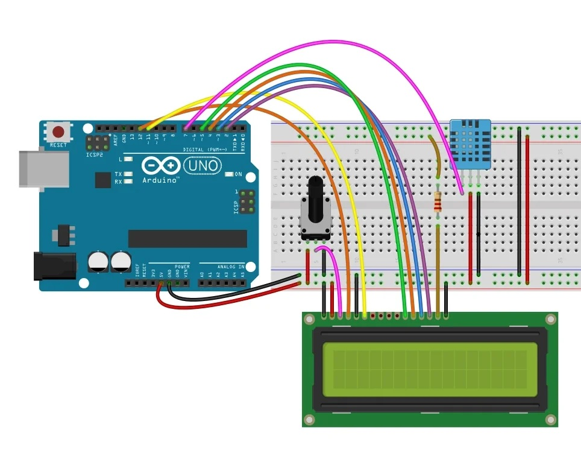

# Arduino Room Environment Monitoring

Meteorološka stanica na Arduinu sa LCD ekranom, DHT11 senzorom, rotacijskim enkoderom i serijskim logovanjem podataka.

## Sadržaj

- RoomEnivronmentMonitoringLogger.ino — Arduino kod za stanicu
- arduino_logger.py — Python skripta za serijsko logovanje podataka u CSV
- RoomEnivronmentMonitoring.jpg — Šema povezivanja 

## Slika spoja

